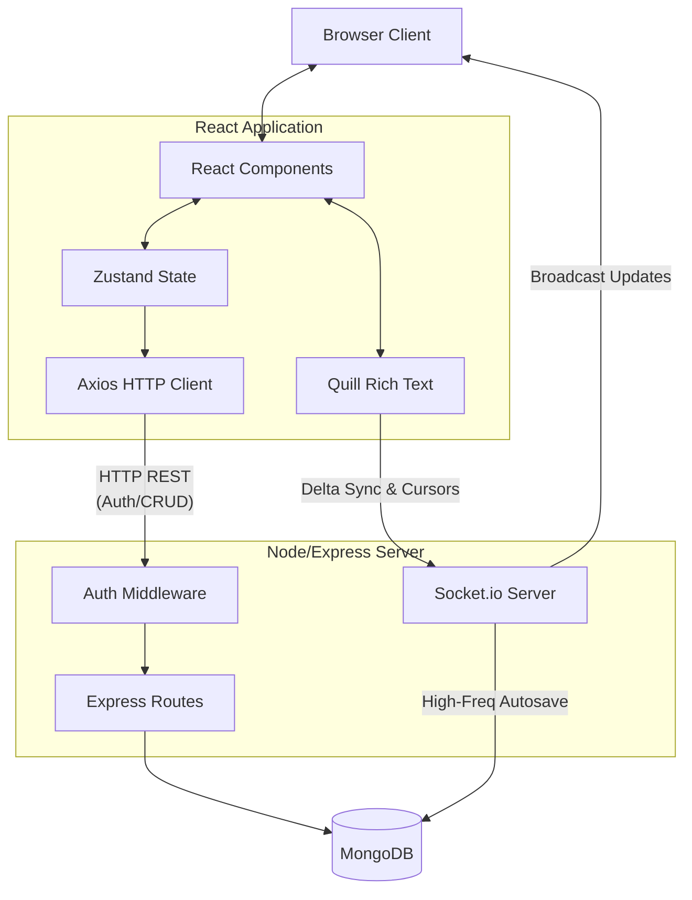
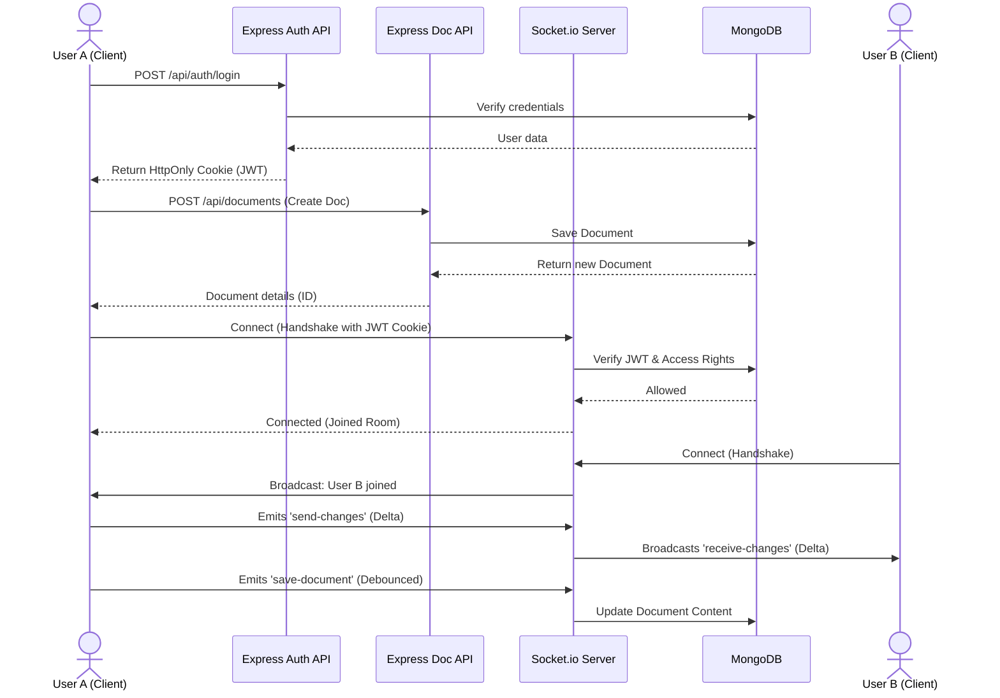

# Collaborative Document Editor

A real-time, rich-text collaborative document editor built with the MERN stack (MongoDB, Express, React, Node.js) and WebSockets. This application allows multiple users to simultaneously edit documents, see live presence indicators, track remote cursors, and securely manage access control.

---

## 🏗 System Architecture

This project is structured as a full-stack monorepo with separated client and server environments.

### Technology Stack
| Layer | Technologies | Purpose |
| :--- | :--- | :--- |
| **Frontend (Client)** | React 19, Vite, TailwindCSS | High-performance UI rendering and utility-based styling |
| **State & API** | Zustand, Axios | Centralized global state and Promise-based REST client |
| **Editor Engine** | Quill.js | Rich-text capabilities and document formatting |
| **Backend (Server)**| Node.js, Express.js | High-throughput server pipelines and REST routing |
| **Database** | MongoDB (Mongoose) | Document-oriented persistence and JSON mapping |
| **Real-Time** | Socket.io, Socket.io-client | Low-latency WebSockets for syncing text deltas & telemetry |
| **Security** | Bcrypt.js, JWT, HttpOnly Cookies | Password hashing and stateless, XSS-protected auth |

### Architecture Flowchart



### Architecture Details
1. **REST API (Stateless):** Handles User Authentication, Document CRUD operations, and access control/collaborator invitations.
2. **WebSocket (Stateful):** Handles low-latency rich-text delta broadcasting (`receive-changes`, `send-changes`), active user tracking, remote cursor telemetry, and high-frequency autosave persistence to MongoDB.

#### End-to-End Interaction Flow



---

## 🚀 Quick Start Guide

### Prerequisites
- Node.js (v18+)
- MongoDB instance (Local or Atlas)

### 1. Clone the Repository
```bash
git clone <repository-url>
cd CollaborativeDocumentEditor
```

### 2. Setup the Backend
Open a terminal and navigate to the `backend` directory.
```bash
cd backend
npm install
```
Create a `.env` file in the `backend` directory:
```env
PORT=5000
MONGO_URI=mongodb://127.0.0.1:27017/collaborative-editor
JWT_SECRET=your_super_secret_key_here
CLIENT_URL=http://localhost:5173
NODE_ENV=development
```
Start the backend server:
```bash
npm run dev
```

### 3. Setup the Frontend
Open a new terminal and navigate to the `frontend` directory.
```bash
cd frontend
npm install
```
Start the frontend development server:
```bash
npm run dev
```

The application will be available at `http://localhost:5173`.

---

## 📚 Detailed Documentation

For deep dives into the specific environments, refer to the nested documentation:
- 📖 **[Frontend Documentation](./frontend/README.md)**: UI Components, Zustand State, Design Systems, etc.
- 📖 **[Backend Documentation](./backend/README.md)**: Express Pipelines, WebSockets, Security, REST APIs, etc.
