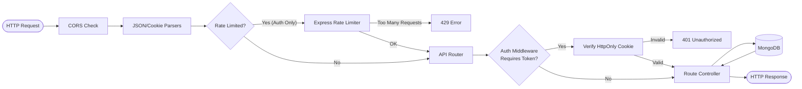
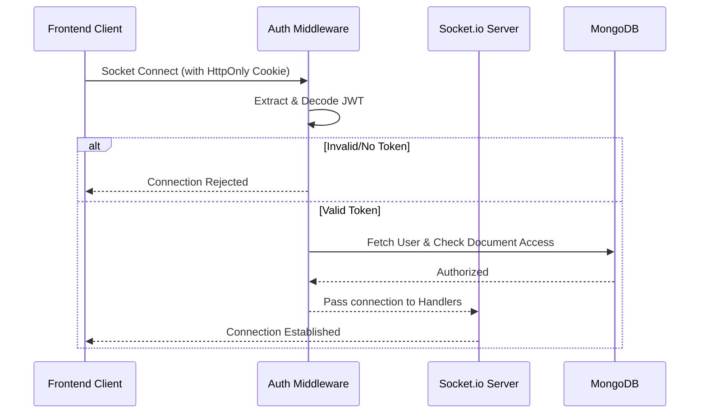

# Backend Documentation (Server)

This directory contains the Node.js / Express backend for the Collaborative Document Editor. It acts as the central hub for database persistence, user authentication, and high-performance WebSocket broadcasting.

## Installed Packages & Setup

### Project Creation Steps
To recreate the foundation of this backend architecture, the following commands were used:
```bash
mkdir backend
cd backend
npm init -y
npm install express mongoose dotenv cors cookie-parser jsonwebtoken bcryptjs socket.io cookie express-rate-limit
npm install --save-dev nodemon
```
*Note: Ensure your `package.json` contains `"type": "module"` to enable ES6 import syntax.*

### Core Packages Used

| Package | Purpose |
| :--- | :--- |
| `express` | Core web server routing framework |
| `mongoose` | ODM for MongoDB database modeling and queries |
| `socket.io` | Real-time bidirectional event-based communication engine |
| `bcryptjs` | Cryptographic password hashing |
| `jsonwebtoken` | Secure stateless authentication tokens |
| `cookie-parser` & `cookie` | Libraries for parsing HTTP cookies in REST APIs and WebSocket Handshakes |
| `express-rate-limit` | IP-based throttling defense against brute-force attacks |
| `dotenv` | Environmental variable management |
| `nodemon` | Development server utility for auto-restarts on file save |

---

## Express Pipelines & Architecture

### Request Pipeline Flowchart



### Data Layer (Mongoose Models)
- **`User` Model:** Stores `name`, `email` (unique index), and `password` (hashed).
- **`Document` Model:** Stores `title`, `content` (Rich text HTML/Delta), `owner` (ObjectId reference), and an array of `collaborators` (ObjectId references).

---

## Security & Authentication

### JWT & HttpOnly Cookies
Authentication is entirely stateless. Upon successful login/registration:
1. A JWT is generated using a server-side secret (`process.env.JWT_SECRET`).
2. The JWT is injected into a secure `HttpOnly` cookie. This prevents malicious client-side JavaScript (XSS attacks) from reading the token.
3. The server's `protect` middleware intercepts subsequent requests, extracts the cookie, and decodes the JWT to verify identity.

### Password Hashing
Before saving a new User to MongoDB, a Mongoose `pre('save')` hook intercepts the document and hashes the plaintext password using **Bcrypt** (Salt rounds: 10). Passwords are never stored in plaintext.

### WebSockets Handshake Security
The Socket.io pipeline is protected by a custom `authorizeSocket` middleware that extracts and decodes the JWT directly from the socket connection's cookie headers, rejecting unauthorized connections before they consume server resources.

#### Security & Real-Time Connection Flow Diagram



---

## REST API Matrix

All routes under `/api/documents` require a valid JWT cookie to access.

| Method | Endpoint | Description | Expected Payload | Required Role / Filter |
| :--- | :--- | :--- | :--- | :--- |
| `POST` | `/api/auth/register` | Registers a new user account | `{ name, email, password }` | Public |
| `POST` | `/api/auth/login` | Authenticates an existing user | `{ email, password }` | Public |
| `POST` | `/api/documents` | Creates a new blank document | `{ title }` (Optional) | Any Authenticated User |
| `GET` | `/api/documents` | Fetches user's dashboard docs | None | Returns only docs where user is Owner or Collaborator |
| `GET` | `/api/documents/:id` | Fetches a specific document | None | Owner or Collaborator |
| `PUT` | `/api/documents/:id/title` | Renames a document | `{ title }` | Owner or Collaborator |
| `DELETE`| `/api/documents/:id` | Deletes a document | None | **Owner Only** |
| `POST` | `/api/documents/:id/collaborators`| Invites user by email | `{ email }` | **Owner Only** |

---

## Advanced / Theoretical Features

> **Note:** The following features are architectural strategies planned for future scalability upgrades and are not currently active in the core repository.

- **Multer Configs & Cloudinary Uploads:** For supporting inline image uploads within the rich-text editor. Multer would act as the memory buffer middleware, streaming binary files directly to Cloudinary buckets to keep the database lightweight.
- **DB Rollback Strategies:** Implementing Mongoose Transactions (`session.startTransaction()`) during complex multi-document operations (like bulk deleting a user and all their associated documents) to ensure atomicity.

---

## Local Developer Onboarding

### Environment Parameters
Create a `.env` file in the `backend` root:
```env
PORT=5000
MONGO_URI=mongodb://127.0.0.1:27017/collaborative-editor
JWT_SECRET=generate_a_secure_random_string
CLIENT_URL=http://localhost:5173
NODE_ENV=development
```

### Starting the Server
Use the **Nodemon dev server** for hot-reloading:
```bash
npm run dev
```

### Render Deployment Guide
To push this architecture to production using Render.com:
1. Connect your GitHub repository to a new Render "Web Service".
2. Set the build command to: `npm install`
3. Set the start command to: `npm start` (which maps to `node server.js`).
4. Ensure all environment variables from your `.env` are mirrored in the Render Environment tab.
5. Update `CLIENT_URL` to point to your live frontend domain.
