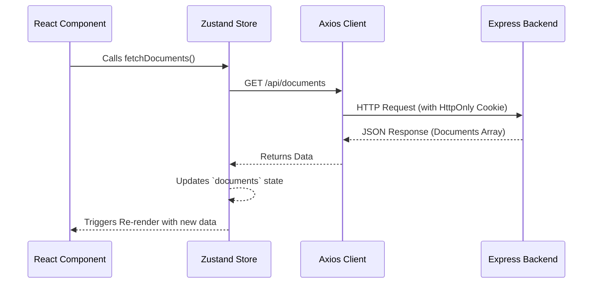

# Frontend Documentation (Client)

This directory contains the React client for the Collaborative Document Editor. It handles real-time rendering, rich-text document state, secure routing, and websocket telemetry.

## 📦 Installed Packages & Setup

### Project Creation Steps
To recreate the foundation of this frontend architecture, the following commands were used:
```bash
npx create-vite@latest frontend --template react
cd frontend
npm install
npm install react-router react-hook-form lucide-react axios zustand
npm install quill @tinymce/tinymce-react highlight.js socket.io-client
npm install tailwindcss @tailwindcss/vite
```

### Core Packages Used

| Package | Purpose |
| :--- | :--- |
| `react` & `react-dom` | Core UI rendering engine |
| `vite` | High-performance local development server and bundler |
| `@tailwindcss/vite` | Utility-first CSS framework plugin for rapid styling |
| `zustand` | Lightweight global state management |
| `axios` | HTTP client for REST API communication |
| `react-router` | Client-side navigation and route protection |
| `react-hook-form` | Performant form state and validation logic |
| `quill` | Robust rich-text editor engine |
| `socket.io-client` | WebSocket client for real-time collaboration |

---

## 🎨 Design Systems & Layout Structures

### UI Styling
The application utilizes **TailwindCSS** for its primary design system.
- **Dark Mode Aesthetic:** The default theme utilizes deep slates (`bg-slate-950`) and glowing brand accents.
- **Responsive Layouts:** Flexbox and CSS Grid are utilized across the Dashboard and Editor components to ensure cross-device compatibility.
- **Glassmorphism:** Navigation bars and dropdown menus employ background blur (`backdrop-blur`) and semi-transparent backgrounds to create a modern, layered depth.

### Security Matrices (Route Protection)
The frontend employs a React Router firewall to manage authenticated states:
- **Public Routes:** `/login`, `/register`. Automatically redirects to `/dashboard` if a valid session exists.
- **Protected Routes:** `/dashboard/:tab`, `/document/:id`. Wrapped in an `<AuthRoute>` component that verifies the global `useAuthStore` session. Unauthenticated users are kicked to `/login`.

#### Client-Side Routing Flowchart
```mermaid
flowchart TD
    Start((User Visits URL))
    AuthCheck{useAuthStore\nIs Authenticated?}
    
    Start --> AuthCheck
    
    AuthCheck -- "Yes" --> IsPublic{Is Route Public?\n(/login, /register)}
    IsPublic -- "Yes" --> RedirectDash[Redirect to /dashboard]
    IsPublic -- "No" --> Allow[Render Protected Component]
    
    AuthCheck -- "No" --> IsProtected{Is Route Protected?}
    IsProtected -- "Yes" --> RedirectLogin[Redirect to /login]
    IsProtected -- "No" --> AllowPublic[Render Public Component]
```

---

## 🧩 React UI Components & Forms

### Component Architecture
The application UI is broken down into isolated, modular sub-components:
- **Editor Workspace:** Separated into `DocumentWorkspace` (layout), `WorkspaceHeader` (nav/titles), `WorkspacePresence` (avatars), `RemoteCursorsOverlay` (live typing telemetry), and `Editor` (Quill instance).
- **Dashboard:** Features persistent URL-parameterized tabs (`/dashboard/documents`, `/dashboard/shared`, `/dashboard/settings`, `/dashboard/trash`) allowing users to reload without losing their active view, rendering grid-based cards with context actions (rename, delete, share).

### Forms & Validation
Authentication forms (Login/Register) are powered by **React Hook Form**:
- **State Handling:** Prevents excessive re-renders during keystrokes.
- **Validation:** Enforces email regex patterns and minimum password lengths before submitting payloads to the Axios API.

---

## 🧠 Data Flow & Zustand Stores

State is managed centrally using **Zustand** rather than prop-drilling or heavy Context APIs.

### `useAuthStore`
- **Actions:** `login()`, `register()`, `logout()`, `checkAuth()`.
- **Lifecycle:** On app mount, `checkAuth()` fires to silently verify session cookies.
- **Data Flow:** Holds the `user` profile object and an `isAuthenticated` boolean.

### `useDocStore`
- **Actions:** `fetchDocuments()`, `createDocument()`, `fetchDocumentById()`, `updateTitleInDashboard()`.
- **Data Flow:** Holds the `documents` array for the dashboard and the `currentDocument` for the active editor.

#### Application State Flow Diagram



---

## 🔌 API & Axios Setup

### Global Configuration
Axios is configured with `withCredentials: true` globally to ensure HttpOnly session cookies (containing JWTs) are automatically attached to every outgoing request.

### API Requests Matrix

| Request Trigger / Action | Axios Endpoint | Method | Payload Data | Expected Response |
| :--- | :--- | :--- | :--- | :--- |
| **User Login** | `/api/auth/login` | `POST` | `{ email, password }` | User Object (Cookie set automatically) |
| **User Registration** | `/api/auth/register` | `POST` | `{ name, email, password }` | User Object (Cookie set automatically) |
| **Load Dashboard** | `/api/documents` | `GET` | *None* | Array of Document Objects |
| **Open Document** | `/api/documents/:id` | `GET` | *None* | Single Document Object with `content` |
| **Create New Doc** | `/api/documents` | `POST` | `{ title? }` | New Document Object |
| **Invite User** | `/api/documents/:id/collaborators`| `POST` | `{ email }` | Success Message |

---

## 🛠 Local Developer Onboarding

### Environment Configuration
Create a `.env` file in the `frontend` root directory:
```env
VITE_API_URL=http://localhost:5000
```
*Note: Vite requires variables to be prefixed with `VITE_` to be exposed to the client.*

### Available Scripts
- `npm run dev`: Boots the Vite hot-module-reloading development server on port 5173.
- `npm run build`: Compiles and minifies the application for production deployment into the `/dist` directory.
- `npm run lint`: Runs ESLint to check for code quality and syntax errors.
